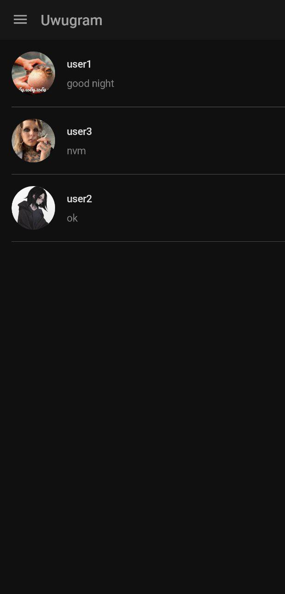
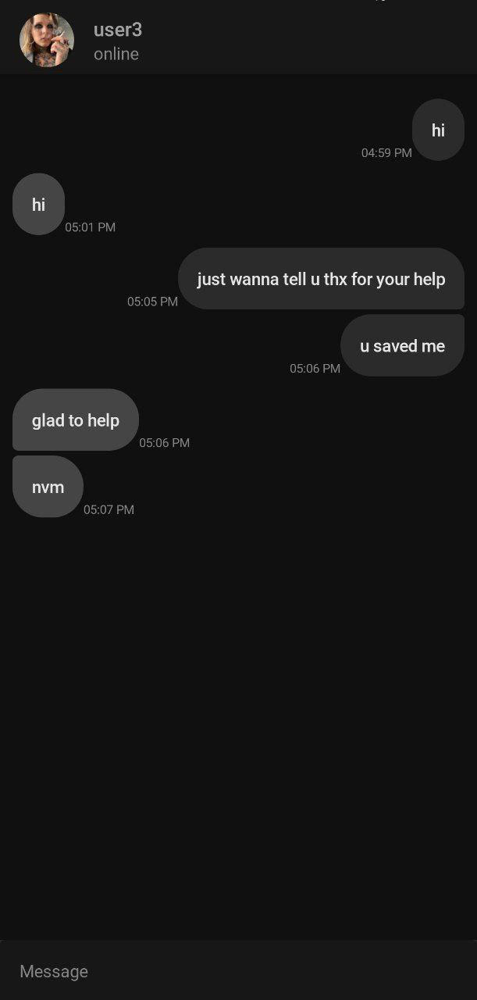
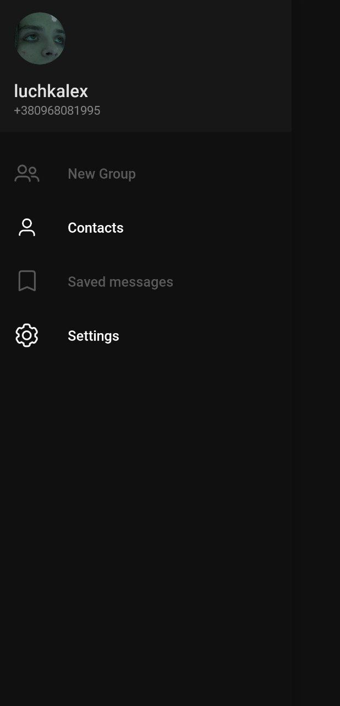

# Uwugram

It is a messenger for android similar to Telegram, is a freeware cloud-based instant messaging service. 
Provides text messaging (voice, video, file sharing in future versions) and several other features.
Used software and technologies: Jetpack Copose toolkit, Kotlin, FIrebase

  

